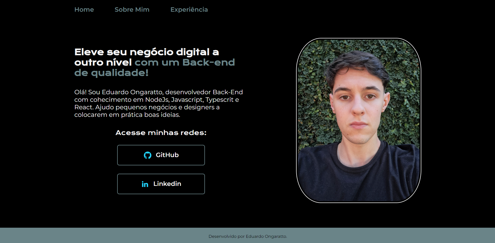

# Projeto de Portfólio

Este é um projeto de portfólio simples desenvolvido com HTML, CSS e utilizando o conceito de Flexbox para o layout. O objetivo deste projeto é demonstrar minhas habilidades de desenvolvimento web e apresentar meu trabalho de forma organizada e atraente.

## Funcionalidades

- Apresentação de informações pessoais e profissionais.
- Exibição de projetos anteriores.
- Layout responsivo para garantir uma experiência consistente em diferentes dispositivos.

## Tecnologias Utilizadas

- HTML5: Utilizado para estruturar o conteúdo da página.
- CSS3: Utilizado para estilizar os elementos HTML.
- Flexbox: Utilizado para criar um layout flexível e responsivo.

## Visualizar

